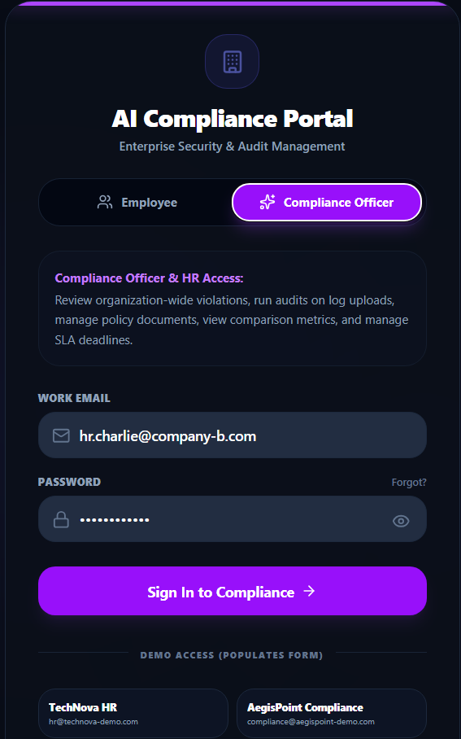
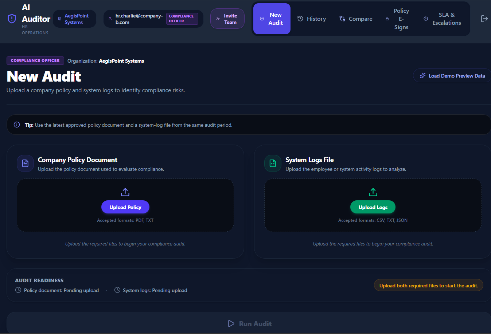
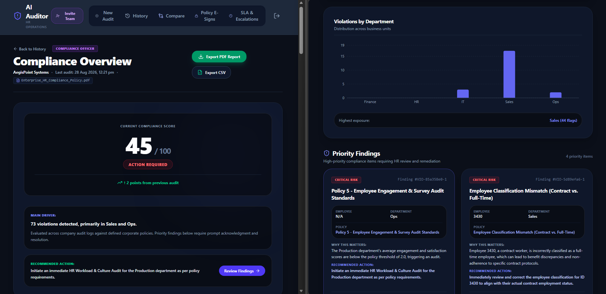
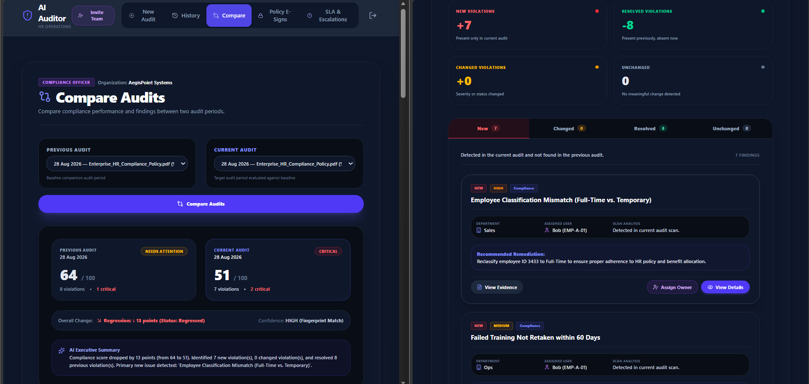
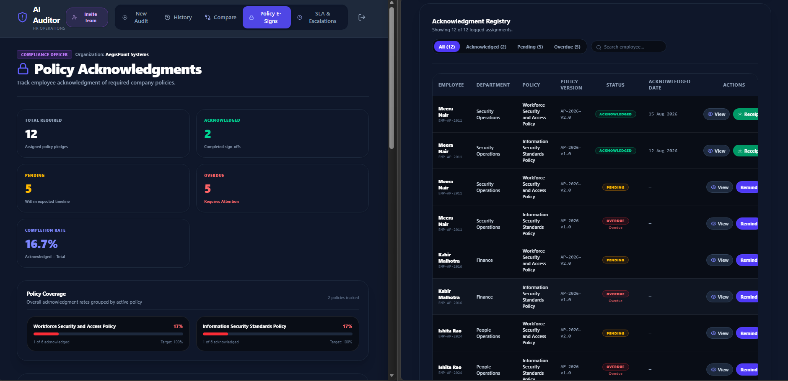
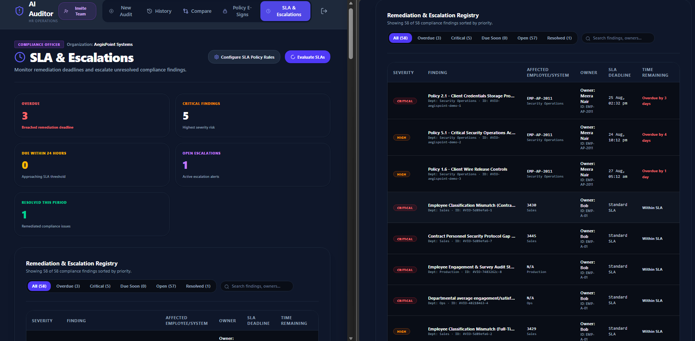

# AI Auditor

An AI-powered HR compliance and risk-management platform that analyzes company policies and system logs, identifies potential violations, explains findings using evidence, tracks policy acknowledgments, manages SLA/escalation workflows, and compares compliance audits over time.

---

## 📌 Project Overview

HR Compliance Officers and Security Auditors face significant overhead reviewing complex corporate policies against large volumes of system access logs. Manual audits are slow, error-prone, and fail to provide real-time SLA visibility or defensible policy sign-off tracking.

**AI Auditor** streamlines this entire audit lifecycle. Powered by Google Gemini LLM API, it parses corporate policy documents (`.pdf`, `.txt`) and system log streams (`.csv`, `.json`, `.txt`), automatically detects compliance violations, ranks risks (`CRITICAL`, `HIGH`, `MEDIUM`, `LOW`), calculates an executive compliance score, enforces SLA resolution countdowns, tracks policy E-signatures, and compares compliance posture over time.

---

## 🚀 Product Workflow

```text
  HR Uploads Policy & System Logs
                │
                ▼
   AI Analyzes Evidence & Rules (Gemini API)
                │
                ▼
  Findings & Compliance Score Generated
                │
                ▼
  HR Investigates, Resolves, or Escalates
                │
                ▼
  HR Tracks Policy E-Signs & SLA Status
                │
                ▼
   HR Compares Compliance Audits Over Time
```

---

## ✨ Key Features

- **Policy Document & System Log Upload**: Upload corporate policy documents (`.pdf`, `.txt`) and system log streams (`.csv`, `.json`, `.txt`).
- **AI-Powered Compliance Analysis**: Automated rule matching powered by Google Gemini LLM API (`gemini-2.5-flash`).
- **Violation Detection & Risk Classification**: Identifies compliance breaches categorized into `CRITICAL`, `HIGH`, `MEDIUM`, and `LOW` severity levels with weighted scoring.
- **Evidence & Explainability**: Cites specific log entries with AI-generated explanations and recommended remediations.
- **Compliance Score & Audit Report**: Generates an executive 0–100 compliance rating with printable PDF report exports.
- **Audit History**: Stores historical audit runs per organization to track long-term risk trajectories.
- **Comparative Audit Analysis**: Compares baseline vs. target audit runs side-by-side to isolate **New**, **Changed**, **Resolved**, and **Unchanged** findings.
- **Policy Acknowledgment Tracking**: Defensible employee sign-off portal with SHA-256 policy document checksums, typed legal signature verification, and tamper-evident receipt hashes.
- **Pending & Overdue Acknowledgment Workflow**: HR tracking ledger monitoring signed vs. pending vs. overdue policy acknowledgments with reminder dispatches.
- **SLA Monitoring & Escalation Workflow**: Monitors resolution deadlines with customizable rules per severity, real-time status ranks (`ON_TRACK`, `WARNING_80`, `BREACHED`, `ESCALATED`), pause/resume controls, and lead escalation routing.
- **Role-Based HR & Employee Experience**: Dedicated HR Auditor Management Dashboard and Employee Compliance Portal.
- **Multi-Tenant Organization Context**: Multi-tenant workspace switching, company onboarding, and file-isolated database ledgers.

---

## 📸 Screenshots & UI Showcase

| 1-Click Login Portal | New Audit Upload Readiness |
| :---: | :---: |
|  |  |
| *Authentication & demo accounts* | *Policy & log upload readiness* |

| AI Audit Analysis & Findings | Comparative Audit Analysis |
| :---: | :---: |
|  |  |
| *Executive score & evidence table* | *New vs. resolved findings diff* |

| Policy E-Sign Portal | SLA & Escalation Center |
| :---: | :---: |
|  |  |
| *Electronic pledge sign-off* | *SLA countdowns & escalation rules* |

---

## 🛠️ Tech Stack

- **Frontend**: React 19, Vite, Tailwind CSS, Lucide Icons, Axios, Recharts, `html2pdf.js`
- **Backend**: Python 3.13, FastAPI, Uvicorn, PyPDF, Pandas, PyJWT, Passlib
- **AI Engine**: Google Gemini API (`google-genai` SDK, `gemini-2.5-flash`)
- **Data Persistence**: File-based tenant-isolated JSON ledgers (`get_tenant_file`)
- **Testing**: Python `unittest`, `FastAPI TestClient` (17 automated test cases)

---

## 🏗️ Architecture Section

See [docs/architecture.md](docs/architecture.md) for detailed technical design documentation.

```text
React 19 Frontend Client (Vite + Tailwind CSS)
            │
            │ REST API (Axios / JWT Auth)
            ▼
FastAPI Backend Server (Python 3.13 + Uvicorn)
            │
            ├──► Google Gemini API (gemini-2.5-flash)
            └──► File-Based Tenant Isolated JSON Ledgers
```

---

## 💻 Local Setup Instructions

### Prerequisites
- Node.js (v18+) & npm
- Python (v3.10+)

### 1. Clone Repository
```bash
git clone https://github.com/Raman-kumar2005/Compliance-and-Audit.git
cd Compliance-and-Audit
```

### 2. Backend Setup
```powershell
cd backend
python -m venv venv
venv\Scripts\activate
pip install -r requirements.txt
cp .env.example .env
# Add your GEMINI_API_KEY to backend/.env
python -m uvicorn main:app --host 0.0.0.0 --port 8000
```

### 3. Frontend Setup
```bash
cd frontend
npm install
cp .env.example .env
npm run dev -- --host 0.0.0.0
```

Open [http://localhost:5173](http://localhost:5173) in your browser.

---

## ⚙️ Environment Variables

Copy `.env.example` to create your local `.env` files.

| Variable Name | Location | Required | Description |
| :--- | :--- | :--- | :--- |
| `GEMINI_API_KEY` | `backend/.env` | **Yes** | Google Gemini API key for AI audit analysis |
| `VITE_API_URL` | `frontend/.env` | Optional | Backend API base URL (Default: `http://localhost:8000/api`) |
| `SMTP_HOST` | `backend/.env` | Optional | SMTP hostname for real email delivery |
| `SMTP_PORT` | `backend/.env` | Optional | TLS SMTP port (Default: `587`) |
| `SMTP_USER` | `backend/.env` | Optional | SMTP authentication username |
| `SMTP_PASSWORD` | `backend/.env` | Optional | SMTP authentication password |
| `SMTP_FROM_EMAIL` | `backend/.env` | Optional | Sender email address |

---

## 🎯 Usage & Demo Flow

1. **Sign In**: Open [http://localhost:5173/login](http://localhost:5173/login) and select a 1-click demo account (e.g. `TechNova HR` or `TechNova Employee`).
2. **Upload & Run Audit**: Click **New Audit**, upload policy and log files (or click **Load Demo Preview Data**), and click **Run Audit**.
3. **Review Findings**: Inspect the compliance score gauge, risk metrics, and violation findings table with cited log evidence.
4. **Compare Audits**: Navigate to **Compare** tab to compare baseline vs. target audit runs over time.
5. **Policy E-Signs**: Navigate to **Policy E-Signs** tab to view employee sign-off statuses or execute a legal pledge.
6. **SLA & Escalations**: Navigate to **SLA & Escalations** tab to review resolution countdowns, pause/resume SLAs, or escalate critical breaches.
7. **Notify Employee**: Click **[Notify]** on eligible findings to send a privacy-compliant employee notification.

---

## 📹 Video Walkthrough & Demo

> Add a 30–90 second walkthrough video here.

Suggested demo sequence:
1. Log in as HR Compliance Officer.
2. Upload policy and log files (or click Load Demo Preview Data).
3. Run the AI audit.
4. Review compliance score and a high-risk finding.
5. Open policy evidence.
6. Review audit comparison.
7. Show policy acknowledgments and SLA tracking.

---

## 🛡️ Security & Privacy Notes

- **Secrets Protection**: Secrets and API keys are loaded strictly via `.env` files ignored by `.gitignore`.
- **Demo Data Safety**: Built-in demo accounts and sample datasets use fictional corporate records.
- **Privacy Enforcement**: Employee notification emails exclude raw log evidence snippets, salary, age, gender, and demographic attributes.
- **IP Masking**: E-Signature receipts mask client IP addresses (`203.0.113.xxx`).
- **Honest Email Fallback**: When SMTP credentials are unconfigured, notification actions record an auditable demo event (`"Email delivery is not configured. Demo notification recorded."`) rather than claiming email delivery.

---

## 🗺️ Roadmap & Current Limitations

- [x] Multi-tenant organization workspace switching
- [x] Defensible policy E-signature receipt generation with PDF export
- [x] SLA monitoring and manual escalation routing
- [x] HR-controlled employee notification workflow with 5-minute cooldown
- [x] 17 automated backend unit tests for isolation & access control
- [ ] Persistent SQL database backend (PostgreSQL / SQLite migration)
- [ ] Production OAuth2 / SAML single sign-on integration
- [ ] Automated scheduled audit triggers

---

## 📊 Project Status

`Hackathon project — actively being refined as a portfolio project.`

---

## 📄 License

This project is released under the [MIT License](LICENSE).

---

## 👤 Author & Portfolio

- **Developer**: Raman Kumar (`Raman-kumar2005`)
- **Repository**: [https://github.com/Raman-kumar2005/Compliance-and-Audit](https://github.com/Raman-kumar2005/Compliance-and-Audit)
