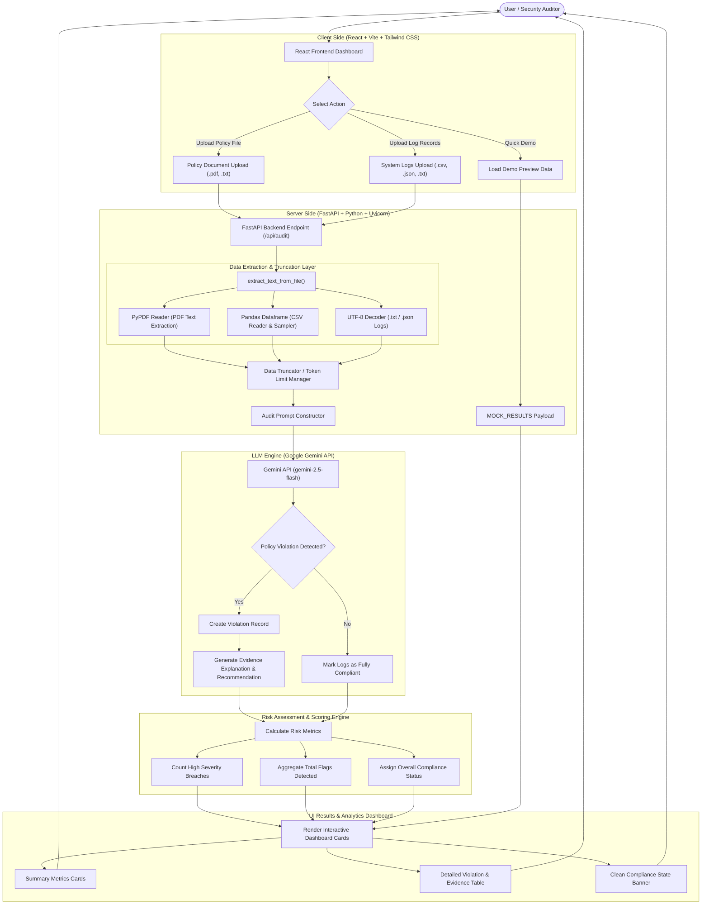

# Enterprise AI Compliance Auditor

Instant policy violation detection & automated log risk analysis powered by FastAPI & Gemini AI.

---

## 🏗️ System Architecture & End-to-End Workflow

---

## 🚀 Tech Stack Breakdown

* **Frontend:** React, Vite, Tailwind CSS, Lucide Icons, Axios
* **Backend:** Python, FastAPI, Uvicorn, PyPDF, Pandas
* **AI Engine:** Google Gemini API (`gemini-2.5-flash`)
